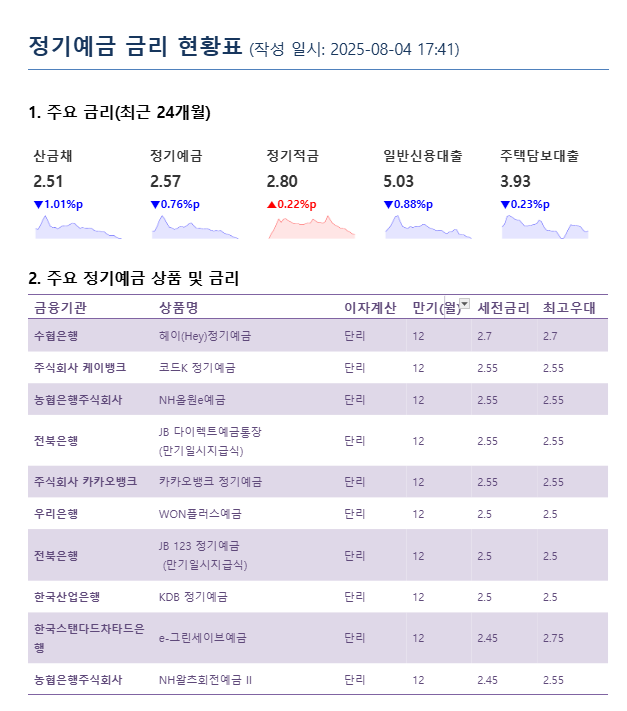
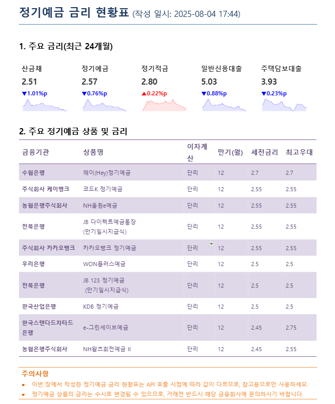

# 📊 정기예금 금리 현황표

Python을 활용해 [금융감독원 Open API](http://finlife.fss.or.kr/)로부터 정기예금 상품 데이터를 수집하고, 엑셀·이미지·워드(.docx) 형식의 보고서를 자동으로 생성합니다.

## 🔧 주요 기능

- 📥 **금융상품 데이터 수집**  
  금융감독원의 `금융상품 한눈에` Open API로부터 정기예금 데이터를 수집  
  ECOS의 금리지표 데이터 수집

- 📈 **금리 시각화 이미지 생성**  
  최근 3년의 금리 지표 데이터를 그래프로 시각화 (PNG)

- 📄 **보고서 자동 생성 (Word)**  
  주요 지표와 예금상품을 포함한 표 형식 보고서를 `.docx`로 생성  
  > **주의: Microsoft Word에서 열어야 열 너비 등 서식이 정확히 반영됩니다. Google Docs에서는 제한적입니다.**

---

## 📁 프로젝트 구조
```
term_deposit/
├── visualise.py # 데이터 시각화
├── interest_rate_docx.py # 보고서 작성(docx)
├── utils/
│ ├── preprocess.py    # 경로 로드 및 api 데이터 불러오기
│ └── init_docx.py   # docx 파일 초기화
├── img/
│ ├── 산금채.png
│ ├── 일반신용대출.png
│ ├── 정기예금.png
│ ├── 정기적금.png
│ └── 주택담보대출.png
├── output/
│ ├── ecos_interest.xlsx    # ecos 금리 데이터
│ ├── fss.xlsx    #  fss 정기예금 상품 데이터
│ ├── result.docx    # 결과 보고서
│ └── mini_result.docx    # 미니 프로젝트 추가    
└── README.md
```

---
## 💵 주요 금리 지표

1. 산금채 금리 (산업금융채권 금리)  
정의: **한국산업은행이 발행하는 채권의 수익률**로, 준국채 성격을 지닌 안정적인 금융상품입니다.  
특징: 일반적으로 **시장 금리의 흐름**을 반영하며, 시중금리와 정책금리 사이의 연결고리 역할을 합니다.  

2. 정기예금 금리  
정의: 일정 금액을 **한 번에 예치**하고, 약정된 기간이 지나 만기 시 원금과 이자를 수령하는 상품의 금리입니다.  
특징: 예치 기간과 우대 조건에 따라 금리가 다르며, 가장 기본적인 저축 수단 중 하나입니다.  

3. 정기적금 금리  
정의: **매월 일정 금액**을 납입하고 만기 시 원금과 이자를 수령하는 적립식 저축 상품의 금리입니다.  
특징: 정기예금보다 금리가 다소 높은 경우도 있으며, 규칙적인 저축 습관을 형성하는 데 유리합니다.  

4. 일반신용대출 금리  
정의: 담보 없이 **개인의 신용도**를 기반으로 제공되는 대출 상품의 금리입니다.  
특징: 금리는 개인 신용등급, 금융기관, 대출 조건 등에 따라 다양하며, 보통 담보대출보다 높습니다.  

5. 주택담보대출 금리  
정의: **주택을 담보**로 설정하고 제공받는 대출 상품의 금리입니다.  
특징: 장기 대출이 가능하며 금리가 상대적으로 낮은 편입니다. 대출 규모가 크기 때문에 금리 변화가 민감하게 작용합니다.  

이러한 금리 지표들은 금융시장과 실물경제의 변화를 반영하며,  
소비자 입장에서는 저축·대출 전략을 세우는 데 매우 중요한 참고 자료가 됩니다.  
따라서 본 보고서에서는 각 지표의 월별 추이와 변동폭을 직관적으로 확인할 수 있도록 시각화하여 제공합니다.

---

## 📑결과물


---
### 미니 프로젝트


---
## PLUS ALPHA
cron을 활용한 깃허브에 월별 대출 금리 보고서 자동 업데이트 하기  
🐾[이동하기](https://github.com/beening01/loan)
- 문제점: ECOS API KEY를 하루만 할당해 줌  
> 들어가서 연장해줘야함..🥲